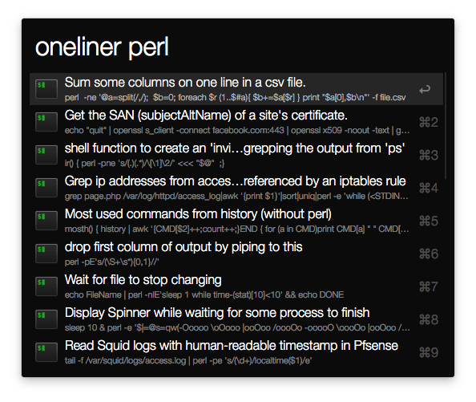

# Command Line Oneliners for Alfred app

Alfred workflow to query and fetch command line oneliners from [commandlinefu.com](commandlinefu.com)

## Usage

Activate the keyword ```oneliner``` and start typing for the search terms. Activating ```Enter``` on any results copies the command in the clipboard and tries to past it in the frontmost app. ```Cmd + Enter``` opens the command URL in the browser.

Keep in mind the search results are provided by the commandlinefu.com's API.



## Installation
Download the [alfred-commandline-oneliners-workflow.alfredworkflow](alfred-commandline-oneliners-workflow.alfredworkflow?raw=true) and import to Alfred 2.


## Changelog
* _2015-09-17_ Released
